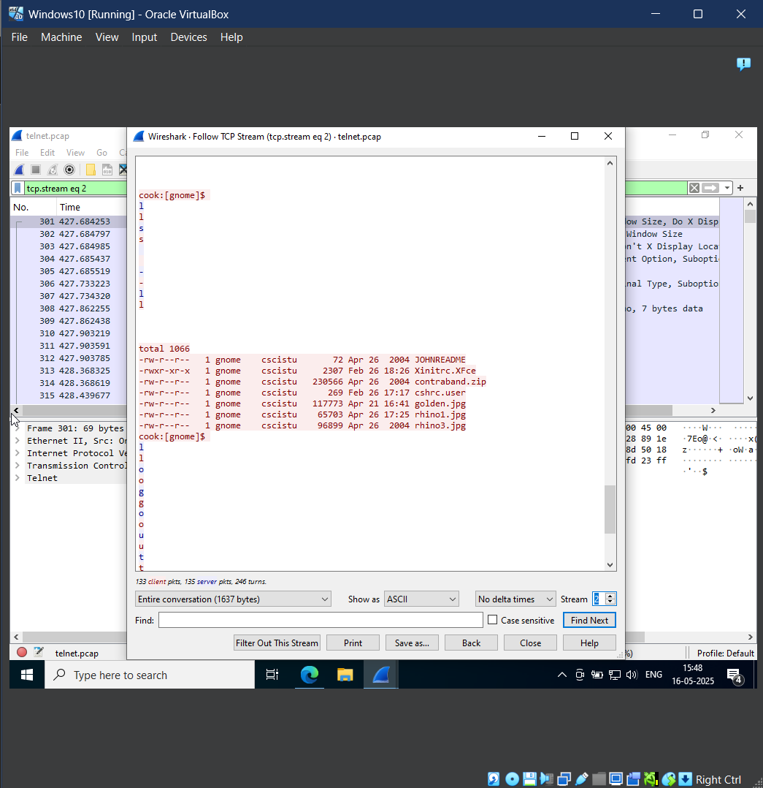
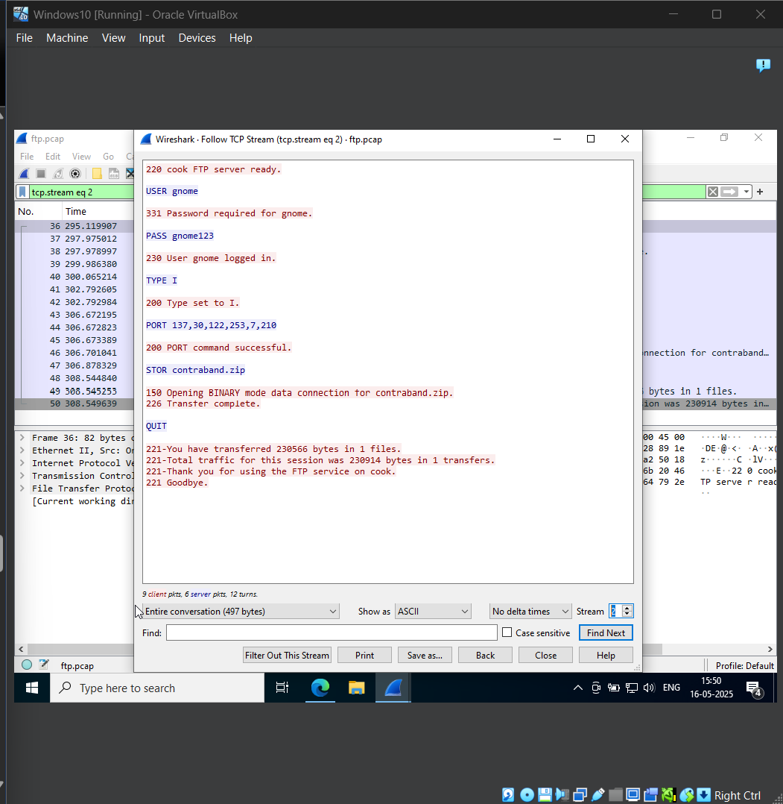
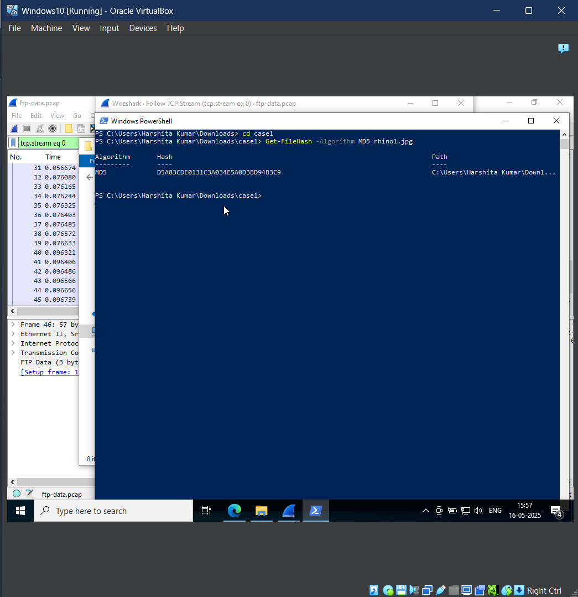

# F 202: Rhino Hunt with Wireshark

### F 202.1
The flag for this part is the name of the file which contain's a message for JOHN. To find this- 
1. We first open the rhino.log file in Wireshark.
2. Then segregate the telnet traffic into a separate file.
3. Then inside the telnet packets, we follow the TCP Stream. There are 3 such streams to look at.
4. As we browse through the data in each stream, we find the 3rd stream has a suspicious message addresses to John.
5. Right after the message, there's some directories and files listed, with one file named as JOHNREADME.
6. Thus our first flag is JOHNREADME.

### F 202.2
The flag for this part is the name of the 3rd file the user transferred. For this we'll follow the FTP packets. 
1. First segregate the FTP packets into a separate file.
2. Then follow the TCP stream of the packets.
3. Analyze the data of each stream. You'll notice that each stream contains a file name. There are 3 streams in total.
4. Take the file name in the 3rd stream as the flag - contraband.zip

### F 202.3
Now for this flag we need to extract the file that the user transferred and then get it's MD5 hash value. 
1. First we extract the ftp-data packets from the rhino.log file.
2. Then we follow the TCP Stream in the ftp-packets.
3. We need the hash value of the first file, so we first convert the 'Show data as' to Raw. And then Save the file with .jpg extension.
4. Get the hash value for this .jpg file which contains the image of a rhinosaurus. The first 4 values of the has is the flag- D5A8

### F 202.4
To find the flag in this exercise, we need to extract the zip file the user tranfered. 
1. For this as well we need to analyze the ftp-data packets. While going through the each of the TCP streams of data, check the size of each stream.
2. Note that one stream has a much larger size than the other streams. This will be the extration target.
3. After extracting the zip file, we'll notice that the image inside is password protected. In order to crack the password, use this site: https://www.lostmypass.com/file-types/zip/
4. Through the lostmypass site, we find the password of the file as 'monkey'. Enter this password while extracting the file.
5. Then go to powershell and get the MD5 hash value of the extracted file.
6. The first 4 digits are the flag for this exercise- ED87

