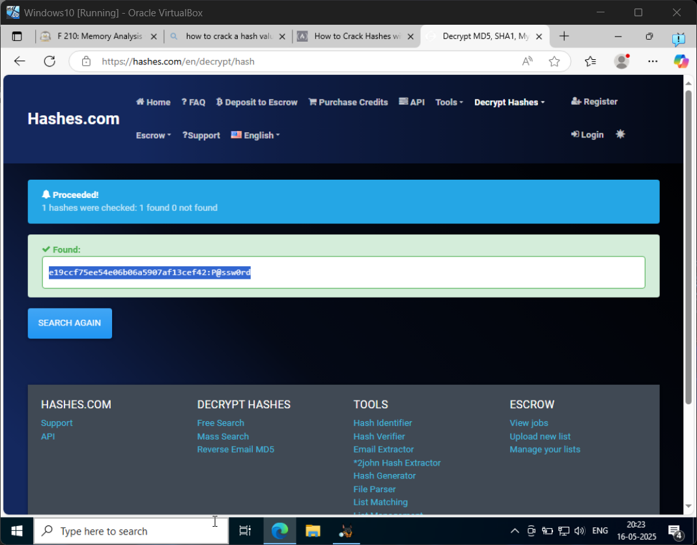

# F 210: Memory Analysis with Autopsy

### F 210.1
In this section, the flag is said to be Waldo's password. We are told to find it in: 
Data Sources -> memdump.mem_1 Host -> memdump.mem -> ModuleOutput -> consoles 
The flag is: Apple123

### F 210.2
In this section, the flag is Waldo's password hash, which we find in the same path but differnt file, called hashdump. 
The flag is: cfeac129dc5e61b2eb9b2e7131fc7e2b

### F 210.3
In this section, the flag is the value of default password, which is in the file lsadump in the previous file path. 
The flag is: P@ssw0rd

### F 210.4
In this section, the flag is the name of the executable listening on port 8080, found in the file netscan in the same file path. 
The flag is: ftpbasicsvr.exe

### F 210.5
In this section, the flag is the name of the executable mentioned in the task image, present inside the file pslist in the previous file path. 
The flag is: FTK Imager.exe

### F 210.6
In this section, the flag is inside the file shellbags (.....in the same file path) and its the name of the shared folder the machine is connected to. 
The flag is: Network Volume Share

### F 210.7
In this section, the flag is in userassist file, and is the name of the dangerous executable that ran on 13th September, 2013 at 23:07:27. 
The flag is: evil2.exe

### F 210.8
In this extra section, the flag is the password for the probe account in the hashdump section. You'll find the password after cracking the hash value given. You can do that using any available free software online. 
The flag is: P@ssw0rd

