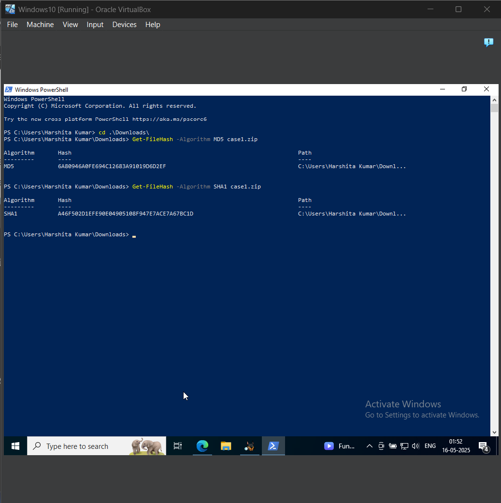
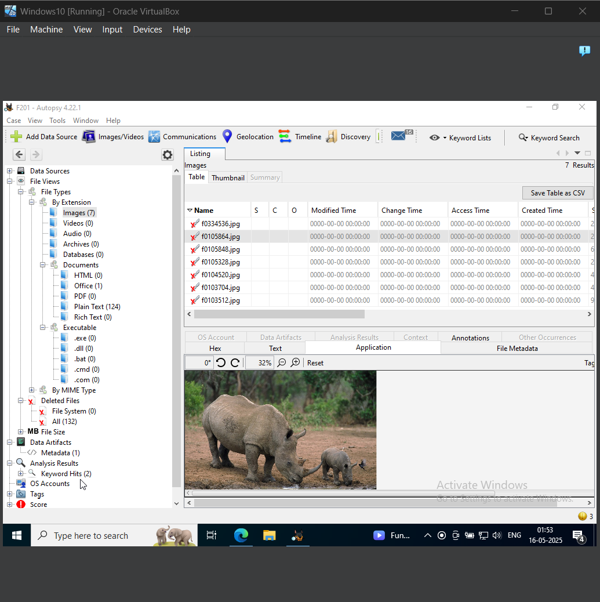
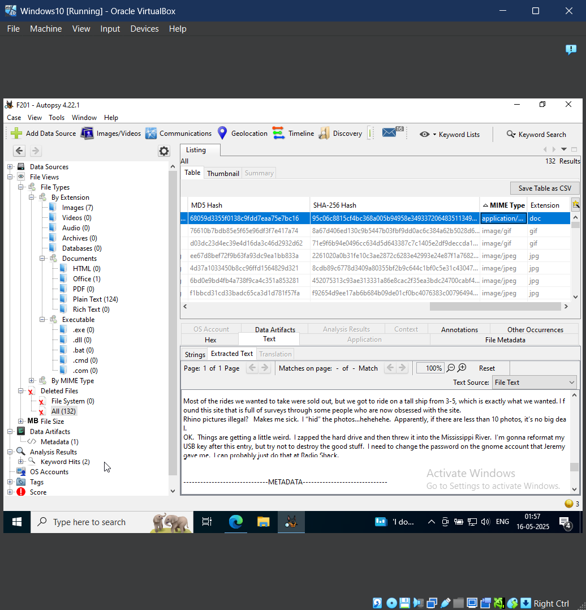
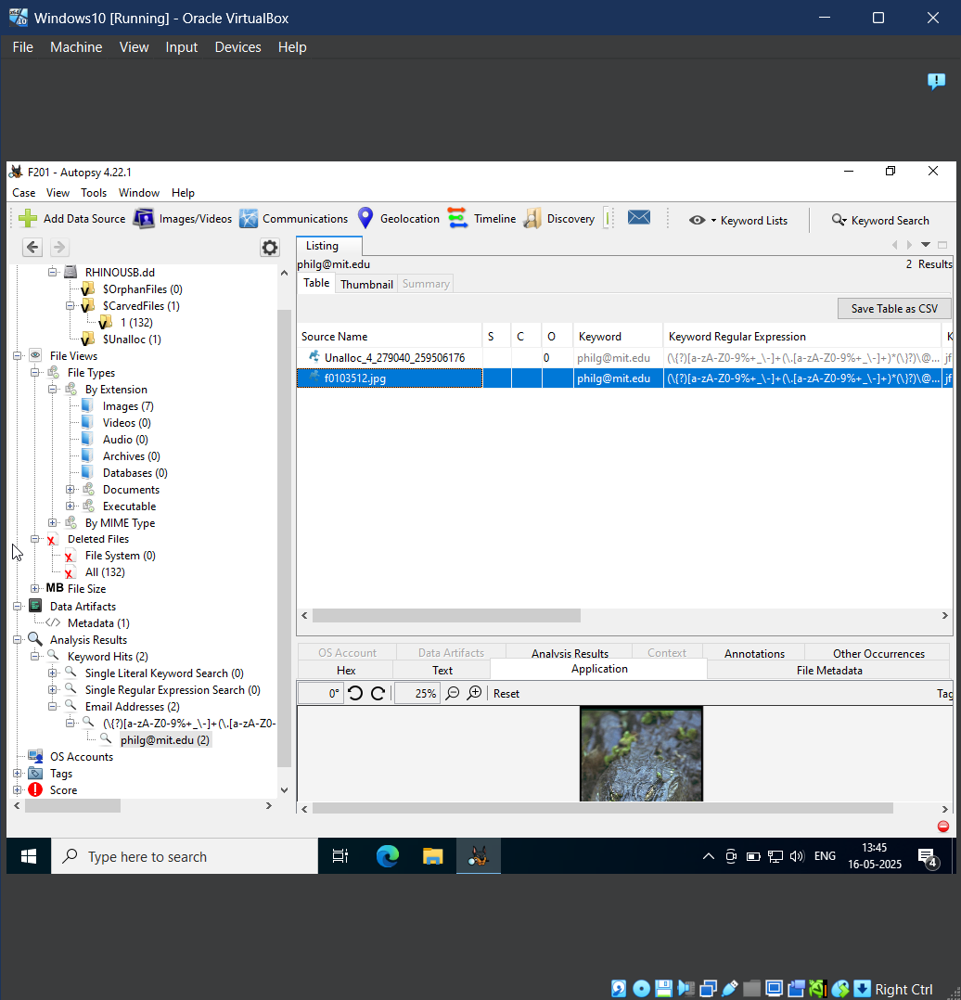

# F201: Rhino Hunt with Autopsy
### F201.1 
1. After downloading the zip file we confirm its integrity by checking the MD5 and SHA1 hash values in Power Shell. If the values match with the given values, then the zip folder is authentic and unaltered.
2. To clear the first flag, we need to simply enter the first 4 digits in the SHA1 hash value which is - 'A46F'.

### F201.2
The second flag is the name of the file in which a mother rhino and a baby rhino are present. This file can be found in the file path: File Types -> By Extension -> Images -> f0105864.jpg

### F201.3
1. To find the flag of this part, we need to explore the deleted files, and find the .doc file from them.
2. This .doc file contains a diary entry, and as we browse through the contents of it, we find that the author threw the hard disk into the Mississippi River.
3. Since the flag is said to the location where the hard drive is currently hidden, we can say the flag is 'Mississippi River'.

### F201.4
1. The flag for this part was the name of a file. 2 files of an MIT email address were present, out of which the undeleted file's name was the flag.
2. We find this file on the path: Analysis Results -> Keyword Hits -> Email Addresses -> [some gibberish name] -> philg@mit.edu -> f0103512.jpg

